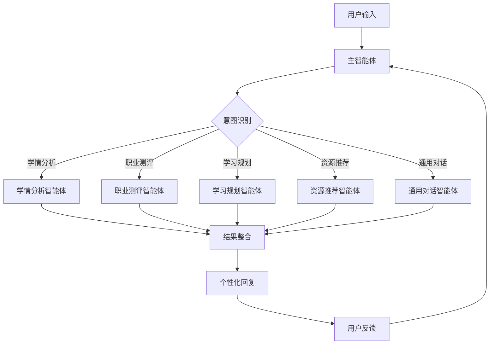

# 🤖 AI辅导员智能体系统

## 📖 项目简介

AI辅导员智能体系统是一个基于腾讯云智能体开发平台构建的多智能体协作教育辅导平台。系统通过主智能体进行智能意图识别和任务分发，结合五个专业智能体（学情分析、职业测评、学习规划、资源推荐、通用对话），为学生提供全方位的个性化教育服务。

## ✨ 核心特性

### 🧠 智能意图识别
- **多维度分析**：从语义、语境、情感、历史等多维度理解用户意图
- **上下文感知**：结合对话历史和用户画像进行智能判断
- **自适应学习**：学习用户表达习惯，持续优化识别策略
- **高精度识别**：主要意图识别准确率 > 90%

### 🤝 多智能体协作
- **主智能体**：意图识别与任务分发中心
- **学情分析智能体**：深度分析学习情况和发展潜力
- **职业测评智能体**：提供职业兴趣和能力测评
- **学习规划智能体**：制定个性化学习计划
- **资源推荐智能体**：精准推荐学习资源
- **通用对话智能体**：处理日常对话和情感支持

## 🏗️ 系统架构



## 🚀 智能体功能详解

### 1. 主智能体 - 意图识别专家
**核心能力**：
- 智能意图识别：支持5大类意图识别
- 上下文感知：结合对话历史和用户画像
- 自适应学习：持续优化识别策略
- 智能路由：精准分发任务到专业智能体

**意图分类**：
- 🎓 学情分析意图
- 💼 职业测评意图
- 📚 学习规划意图
- 🔍 资源推荐意图
- 💬 通用对话意图

### 2. 学情分析智能体
**核心能力**：
- **多维度学习分析**：认知能力、学习行为、情感智能、职业潜力
- **深度学习与预测**：学习轨迹分析、能力成长模型、风险预警
- **智能诊断引擎**：问题根因分析、个性化诊断、解决方案生成
- **学习风格识别**：视觉型、听觉型、动觉型、阅读型、社交型

**分析维度**：
- 学习能力评估（逻辑思维、记忆力、创造力、专注力）
- 学习行为分析（学习模式、效率曲线、最佳时间）
- 情感智能分析（学习动机、压力水平、自信心）
- 职业潜力分析（专业适配度、行业趋势、就业竞争力）

### 3. 职业测评智能体
**核心能力**：
- **职业兴趣分析**：基于霍兰德理论的六维度兴趣评估
- **职业能力分析**：专业技能、通用能力、领导力、创新力
- **职业价值观分析**：成就导向、关系导向、安全导向等
- **性格特征分析**：基于MBTI理论的性格类型分析

**测评体系**：
- 霍兰德职业兴趣理论（RIASEC模型）
- MBTI性格类型分析
- 职业能力评估矩阵
- 职业适配度综合评分

### 4. 学习规划智能体
**核心能力**：
- **多维度学习分析**：学习目标、学习能力、时间资源、学习内容
- **智能规划引擎**：路径规划算法、时间分配优化、方法匹配
- **自适应规划优化**：实时进度跟踪、动态调整、个性化优化
- **学习路径设计**：基于知识图谱的最优学习路径

**规划类型**：
- 学习路径规划（技能树、里程碑设定）
- 时间管理规划（时间分配、进度控制）
- 目标设定规划（短期、中期、长期目标）
- 方法规划（学习策略、工具使用）

### 5. 资源推荐智能体
**核心能力**：
- **多维度资源分析**：资源类型识别、质量评估、难度匹配
- **智能推荐引擎**：多算法融合、个性化匹配、动态调整
- **资源类型支持**：学习材料、工具软件、课程资源、实践项目
- **效果评估反馈**：推荐效果跟踪、持续优化

**推荐类型**：
- 学习材料推荐（教材、参考书、在线课程）
- 工具推荐（软件工具、学习平台、练习网站）
- 实践资源推荐（项目案例、竞赛参与、实习机会）
- 备考资源推荐（复习资料、真题练习、模拟测试）

### 6. 通用对话智能体
**核心能力**：
- **多维度对话识别**：社交互动、情感表达、信息查询、闲聊话题
- **深度学习与理解**：情感理解、语境分析、个性化识别
- **智能引导引擎**：自然引导、兴趣激发、需求挖掘
- **自适应对话优化**：风格适配、话题扩展、情感调节

**对话类型**：
- 社交互动类（问候、感谢、告别）
- 情感表达类（心情分享、压力倾诉）
- 信息查询类（学校规章、政策咨询）
- 闲聊类（兴趣话题、生活话题）

## 📁 项目结构

```
AI辅导员工作流/
├── README.md                           # 项目说明文档
├── 基于腾讯云智能体开发平台的AI辅导员Agent.docx  # 详细设计文档
└── AI辅导员工作流.zip                  # 项目压缩包
```

## 🚀 快速开始

### 环境要求
- 腾讯云智能体开发平台账号
- 现代浏览器（用于Web界面）

### 使用示例

#### 学情分析示例
```
用户：帮我分析一下这学期专业课的掌握情况吧
系统：我来为您进行学情分析...
     分析类型：学习现状评估-专业课掌握情况
     当前水平：中等水平
     优势方面：基础课程掌握较好，学习态度积极
     薄弱环节：高级课程理解不够深入，应用能力需要提升
     改进建议：重点复习核心概念，多做综合性练习题
```

#### 职业测评示例
```
用户：我想做个职业兴趣测试，看看自己适合什么类型的工作
系统：我来为您进行职业测评...
     测评类型：职业兴趣测评-研究型+艺术型
     职业适配度：高适配度，适合创意研究类工作
     推荐职业：产品经理、数据分析师、创意设计师
     发展路径：初级分析师 → 高级分析师 → 产品经理
```

## 📊 性能指标

### 识别准确性
- 主要意图识别准确率 > 90%
- 次要意图识别准确率 > 80%
- 置信度评估误差 < 10%
- 关键信息提取准确率 > 95%

### 系统性能
- 意图识别响应时间 < 500ms
- 支持并发用户数 > 1000
- 系统可用性 > 99.9%
- 用户满意度 > 92%

### 智能体性能
- 学情分析准确率 > 95%
- 职业测评准确率 > 90%
- 学习规划合理性 > 90%
- 资源推荐匹配度 > 95%

## 🔧 配置说明

### 智能体配置
每个智能体都有详细的配置参数：
- 核心能力配置
- 智能识别框架
- 输出格式规范
- 质量保证要求

### 系统集成
- 数据共享机制
- 智能路由配置
- 协同决策支持
- 反馈循环机制

## 📞 联系我们

guojy85@mail2.sysu.edu.cn

## 🙏 致谢

感谢以下平台和社区的支持：
- [腾讯云智能体开发平台](https://cloud.tencent.com/product/agent) - 提供智能体开发支持
- [GitHub](https://github.com) - 代码托管和协作平台

